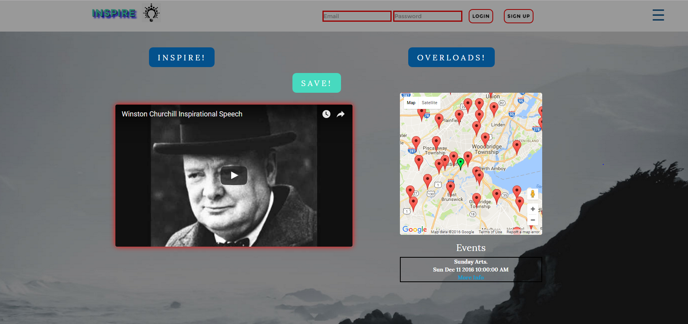
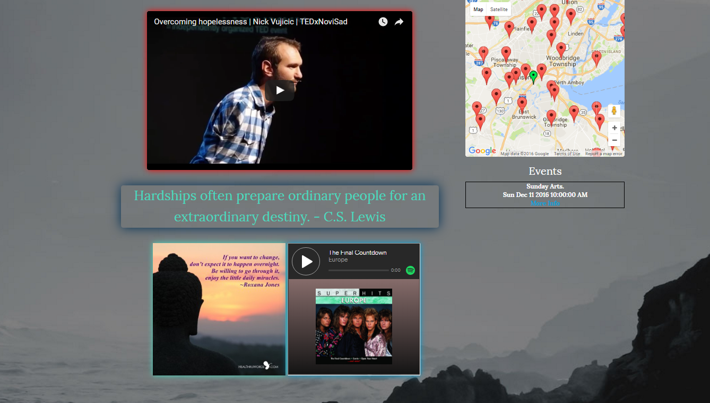
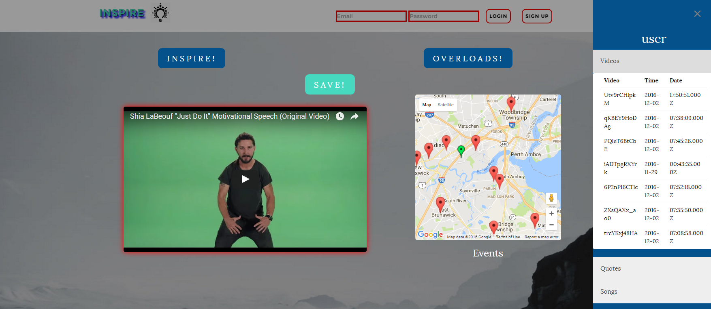
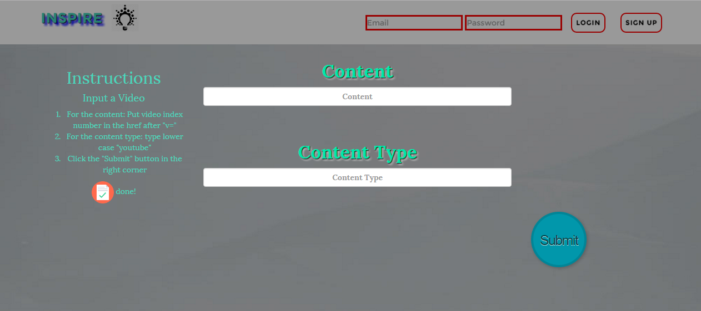

# Inspire

Inspire is a inspirational content app that provides the user with either a quote, video, song, or image to get them motivated. It also allows for users to save the content that they find appealing once they have logged in. The app also geolocates the user and provides local meetups that the user could potentially attend in order to obtain inspiration. The user also has access to the "overload" button which provides all of the content types at once. The content is randomized and there exists a frontend portal that an administrator can use to add to the pool of content links that are populated. 

## Screenshots

Landing Page:



Inspirational Overload: 



Saved Content:



Adding Content:



##Technologies Used:

- Node.js
- Express
- MySQL
- Sequelize
- Method Override
- Body Parser

## Getting Started

### Prerequisites

You must first run:
```
- npm install

```
In order to install the appropriate packages from package.json.

You must have a local connections to JAWSDB the connection information for which is contained within config.json under production.

To run a local version of the database simply change util.js to development instead of production in the run time environment and run the following commands using the Sequelize CLI Library.

```

-sequelize db:migrate
-node server.js

```
This will server to run the migrations and server.js will sync the models hence creating a local version of the db.

After that simply visit localhost:8080 to run a version of the app from your desktop.

## Built With

* Sublime Text 3
* Bootstrap
* Sequelize/MySQL

## Authors

* **Vikas Sundrani** - *Initial Work* - [Vikas Sundrani](https://github.com/Wintermutate)

See also the list of [contributors](https://github.com/Inspire-/graphs/contributors) who participated in this project.

## Acknowledgments

* Google for providing us with all of our intersting button styles
* Isabell for her great project idea
* Everyone for their tireless work and dedication to our project
